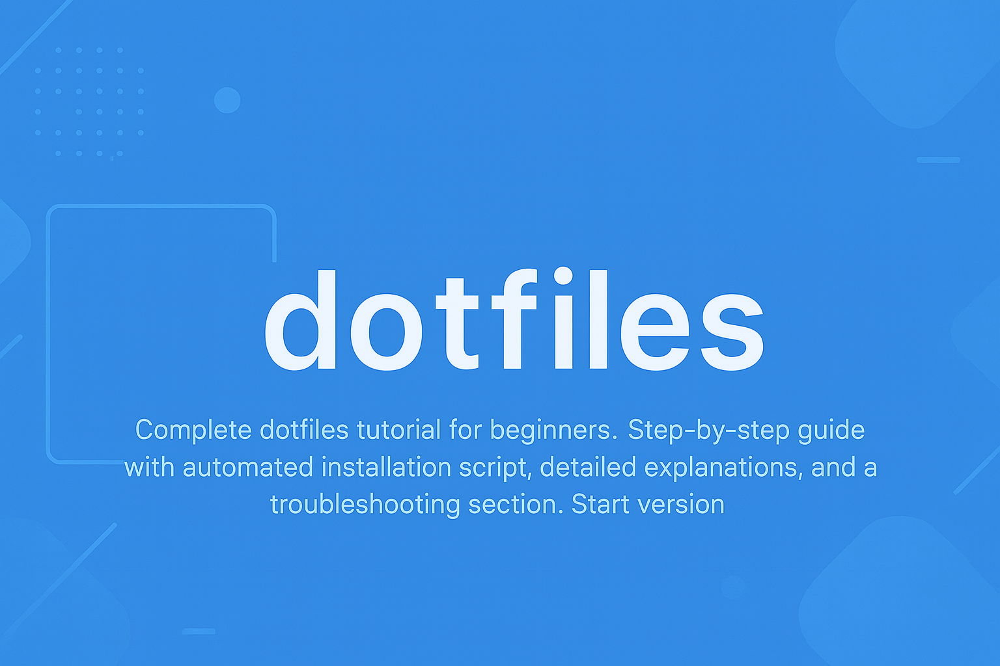

## 🧰 How to Use This Template    
Click the green **"Use this template"** button at the top of the page, then choose **"Create a new repository"**.   
This will create your own copy of this project, which you can modify freely — no need to fork!   

---

<div align="center">
    
</div>

---

<h1 align="center">Dotfiles: A Complete Beginner's Guide</h1> 

# 1. About This Repository

This repository provides a comprehensive, beginner-friendly dotfiles management system designed to help developers quickly set up and maintain a consistent development environment across multiple machines. The project aims to solve the common problem of losing custom configurations when switching computers or reinstalling operating systems.

## 1.1. Who Is This Tutorial For?

This tutorial is designed for developers at various skill levels, with content structured to accommodate different experience levels and learning goals.

**🎓 Students and New Developers**
- Computer science students learning about development environment management
- Bootcamp graduates transitioning to professional development workflows
- Self-taught programmers looking to improve their development setup
- Anyone new to the concept of dotfiles and configuration management

**💼 Working Professionals**
- Developers who work on multiple machines and need consistent setups
- Team leads who want to standardize development environments across their team
- Freelancers who frequently switch between client projects and machines
- DevOps engineers looking to streamline developer onboarding processes

**🔧 Experienced Developers**
- Developers familiar with dotfiles who want a well-organized, educational reference
- System administrators who need to understand modern dotfile management practices
- Open-source contributors who want to improve their development workflow documentation

## 1.2. What Will You Learn?

By following this tutorial, you will gain comprehensive knowledge and practical skills in development environment management:

**📁 Understanding Dotfiles**
- What dotfiles are and why they're essential for developers
- The role of hidden files in Unix-like systems
- How configuration files control tool behavior
- The relationship between dotfiles and development productivity

**🔗 Symbolic Links and File System Management**
- How symbolic links work and their advantages over regular files
- File system concepts relevant to dotfile management
- Understanding the difference between hard links and symbolic links
- Best practices for organizing configuration files

**🚀 Automation and Scripting**
- Creating robust installation scripts with error handling
- Implementing backup strategies that prevent data loss
- Writing cross-platform compatible shell scripts
- Understanding script execution permissions and security

**🐚 Shell Configuration Mastery**
- Customizing bash and zsh for maximum productivity
- Creating useful aliases and functions for common tasks
- Managing environment variables and PATH settings
- Understanding shell startup sequences and configuration loading

**⚙️ Tool-Specific Configuration**
- Git configuration: aliases, user settings, and global preferences
- Vim/Neovim customization: key mappings, plugins, and themes
- Terminal and readline configuration for improved editing
- Cross-tool integration and workflow optimization

## 1.3. Prerequisites

The prerequisites vary significantly based on your current experience level:

**For users familiar with dotfiles and shell scripting:**
- Jump directly to customization and start modifying configurations in the respective directories
- Focus on the installation script to understand the backup and linking mechanisms
- Extend the system by adding your own configurations and modifying the installation process

**For users experienced with shell but new to dotfiles:**
- Start with the "What are dotfiles?" section to understand the fundamental concepts and benefits
- Review the installation process focusing on understanding symbolic links and backup strategies
- Explore existing configurations to understand their purpose
- Reference the troubleshooting section for common issues and solutions

**For complete beginners:**
- Begin with basic concepts by reading through sections 1-3 to understand what dotfiles are and why they're useful
- Follow the Quick Start guide using the step-by-step installation process exactly as written
- Learn incrementally by starting with basic configurations and gradually adding complexity
- Use the troubleshooting section to reference common issues as they arise
- Practice with safe modifications by beginning with simple aliases before making complex changes

## 1.4. Project Structure

```
Folder PATH listing
+---backups                    <-- Automatic backups of your original files
│       +---20250905_113445   <-- Timestamped backup directory
│
+---git                        <-- Git configuration (aliases, settings)
│
+---images                     <-- Contains project images and assets
│       banner.png             <-- Project banner image
│       banner.png…            <-- Windows zone identifier file
│
+---misc                       <-- Miscellaneous tool configurations
│
+---shell                      <-- Shell configurations (bash, zsh)
│
+---vim                        <-- Vim editor configuration
│
        install.sh             <-- Automated installation script
        README.md              <-- Project documentation
```

# 2. What are dotfiles?

Dotfiles are hidden configuration files (they start with a dot `.`) that customize your development environment. Think of them as your personal settings for tools like your shell, text editor, and version control system.

# 3. 🎯 Why Use Dotfiles?

As a developer, you probably work on multiple machines or reinstall your system occasionally. Without dotfiles, you'd have to manually recreate all your customizations every time. Dotfiles solve this by:

- **🔄 Consistency**: Same environment across all your machines
- **⚡ Speed**: One command to set up your entire development environment
- **📚 Learning**: Track and version control your configuration changes
- **🛡️ Backup**: Never lose your carefully crafted settings again

# 4. 📁 What's Inside This Repository

## 4.1. Project Structure Overview

This repository is organized into logical directories, each containing specific types of configuration files. The modular structure makes it easy to understand, customize, and maintain your dotfiles.

## 4.2. Complete Directory Structure

```
Folder PATH listing
+---backups                    <-- Automatic backups of your original files
│       +---20250905_113445   <-- Timestamped backup directory
│
+---git                        <-- Git configuration (aliases, settings)
│
+---images                     <-- Contains project images and assets
│       banner.png             <-- Project banner image
│       banner.png…            <-- Windows zone identifier file
│
+---misc                       <-- Miscellaneous tool configurations
│
+---shell                      <-- Shell configurations (bash, zsh)
│
+---vim                        <-- Vim editor configuration
│
        install.sh             <-- Automated installation script
        README.md              <-- Project documentation
```

## 4.3. Detailed Directory Breakdown

### Root Directory
```
Folder PATH listing
        install.sh             <-- Automated installation script
        README.md              <-- Project documentation
```

**Purpose**: Contains the main installation script and project documentation.

**Key Files**:
- `install.sh`: The automated installation script that handles backup creation, symbolic link creation, and error handling
- `README.md`: Comprehensive documentation explaining the project, installation process, and customization options

### Backups Directory
```
Folder PATH listing
+---20250905_113445           <-- Timestamped backup directory
│
```

**Purpose**: Stores automatic backups of your original configuration files before installation.

**Key Features**:
- Timestamped directories (format: YYYYMMDD_HHMMSS)
- Preserves your original configurations safely
- Allows easy restoration if needed
- Created automatically during installation

### Git Directory
```
Folder PATH listing
        (empty - ready for git config files)
```

**Purpose**: Contains Git configuration files for version control customization.

**Intended Files**:
- `.gitconfig`: Global Git settings, user information, aliases, and preferences
- `.gitignore_global`: Global ignore patterns for all Git repositories
- `.gitattributes`: Global Git attributes for consistent line endings and file handling

### Images Directory
```
Folder PATH listing
        banner.png             <-- Project banner image
│       banner.png…            <-- Windows zone identifier file
```

**Purpose**: Contains project assets and documentation images.

**Files**:
- `banner.png`: Project banner image used in documentation
- `banner.png…`: Windows zone identifier file (system-generated)

### Misc Directory
```
Folder PATH listing
        (empty - ready for miscellaneous config files)
```

**Purpose**: Contains miscellaneous tool configurations that don't fit into other categories.

**Intended Files**:
- `.inputrc`: Readline configuration for command-line editing
- `.tmux.conf`: Terminal multiplexer configuration
- `.ssh/config`: SSH client configuration
- `.curlrc`: cURL configuration
- `.wgetrc`: Wget configuration

### Shell Directory
```
Folder PATH listing
        (empty - ready for shell config files)
```

**Purpose**: Contains shell-specific configuration files for command-line customization.

**Intended Files**:
- `.bashrc`: Bash shell configuration (aliases, functions, environment variables)
- `.zshrc`: Zsh shell configuration (if using zsh)
- `.profile`: Login shell configuration (runs when you log in)
- `.bash_logout`: Commands to run when you log out
- `.bash_aliases`: Separate file for shell aliases
- `.bash_functions`: Separate file for shell functions

### Vim Directory
```
Folder PATH listing
        (empty - ready for vim config files)
```

**Purpose**: Contains Vim/Neovim editor configuration files.

**Intended Files**:
- `.vimrc`: Main Vim configuration file
- `.viminfo`: Vim's command and search history
- `.vim/`: Directory for Vim plugins and additional configuration
- `init.vim`: Neovim configuration file (alternative to .vimrc)

## 4.4. Configuration File Purposes

| Directory | Purpose | Key Configuration Files | What They Control |
|-----------|---------|------------------------|-------------------|
| **shell/** | Shell behavior and productivity | `.bashrc`, `.zshrc`, `.profile` | Command aliases, environment variables, shell functions, prompt customization |
| **git/** | Version control workflow | `.gitconfig`, `.gitignore_global` | User settings, aliases, merge tools, global ignore patterns |
| **vim/** | Text editor customization | `.vimrc`, `.viminfo` | Key mappings, plugins, syntax highlighting, editor behavior |
| **misc/** | Other development tools | `.inputrc`, `.tmux.conf` | Command-line editing, terminal multiplexing, SSH settings |
| **backups/** | Safety and recovery | Timestamped directories | Original file preservation, easy restoration |

## 4.5. File Organization Principles

**🎯 Modular Design**: Each directory contains related configuration files, making it easy to understand and maintain.

**🔗 Symbolic Linking**: The installation script creates symbolic links from your home directory to files in this repository, allowing you to edit configurations in one place.

**📦 Version Control**: All configuration files are tracked in Git, allowing you to version control your development environment.

**🛡️ Safe Installation**: Automatic backups ensure your original configurations are never lost during installation.

**🌐 Cross-Platform**: The structure works consistently across Linux, macOS, and Windows (WSL).

## 4.6. Adding New Configuration Files

When adding new configuration files to this repository:

1. **Choose the appropriate directory** based on the tool or purpose
2. **Follow naming conventions** (use dot prefix for hidden files)
3. **Update the installation script** to include the new file
4. **Test the installation** to ensure the new file is properly linked
5. **Document the purpose** of the new configuration in this README

**Example**: To add a new shell alias file:
```bash
# Create the file in the shell directory
touch ~/.dotfiles/shell/.bash_aliases

# Add content to the file
echo "alias ll='ls -la'" >> ~/.dotfiles/shell/.bash_aliases

# Update install.sh to include the new file
# Add: link_file "$DOTFILES_DIR/shell/.bash_aliases" "$HOME/.bash_aliases"
```

# 5. 🚀 Quick Start (For Beginners)

## 5.1. Step 1: Clone the Repository

```bash
# Navigate to your home directory
cd ~

# Clone this repository (replace with your actual repository URL)
git clone https://github.com/yourusername/dotfiles.git ~/.dotfiles
```

## 5.2. Step 2: Run the Installation Script

```bash
# Navigate to the dotfiles directory
cd ~/.dotfiles

# Make the script executable
chmod +x install.sh

# Run the installation
./install.sh
```

**That's it!** 🎉 Your dotfiles are now installed.

# 6. 🔍 What Happens During Installation?

The installation script does several important things:

1. **📦 Creates a backup**: Your original configuration files are safely backed up with a timestamp
2. **🔗 Creates symbolic links**: Links your home directory files to the dotfiles in this repository
3. **✅ Preserves existing links**: Won't overwrite if already properly linked
4. **📝 Provides feedback**: Shows you exactly what's happening with colored output

## 6.1. Example Installation Output:
```
Starting dotfiles installation...
Backup directory: /home/username/dotfiles/backups/20240115_143022

Setting up shell files...
Linking /home/username/dotfiles/shell/.bashrc to /home/username/.bashrc
Linking /home/username/dotfiles/shell/.zshrc to /home/username/.zshrc

Setting up git files...
Linking /home/username/dotfiles/git/.gitconfig to /home/username/.gitconfig

Installation complete!
Backup of your original dotfiles can be found in /home/username/dotfiles/backups/20240115_143022
```

# 7. 🛠️ Understanding the Components

## 7.1. Shell Configuration (`shell/`)

Your shell is the command-line interface you use. These files customize how it behaves:

- **`.bashrc`**: Bash shell configuration (aliases, functions, environment variables)
- **`.zshrc`**: Zsh shell configuration (if you use zsh instead of bash)
- **`.profile`**: Login shell configuration (runs when you log in)
- **`.bash_logout`**: Commands to run when you log out

## 7.2. Git Configuration (`git/`)

Git is version control software. These files customize how Git behaves:

- **`.gitconfig`**: Git settings, aliases, and user information
- **`.gitignore_global`**: Files to ignore globally across all Git repositories

## 7.3. Vim Configuration (`vim/`)

Vim is a powerful text editor. These files customize its behavior:

- **`.vimrc`**: Vim settings, key mappings, and plugin configurations
- **`.viminfo`**: Vim's command and search history

## 7.4. Miscellaneous (`misc/`)

Other useful configurations:

- **`.inputrc`**: Readline settings (affects command-line editing in many programs)

# 8. 🎨 Customizing Your Dotfiles

## 8.1. Adding a New Configuration File

1. **Create the file** in the appropriate directory:
   ```bash
   # For example, to add a new shell alias
   echo "alias ll='ls -la'" >> ~/.dotfiles/shell/.bashrc
   ```

2. **Update the installation script** to include your new file:
   ```bash
   # Add this line to install.sh in the appropriate section
   link_file "$DOTFILES_DIR/shell/.your_new_file" "$HOME/.your_new_file"
   ```

3. **Re-run the installation**:
   ```bash
   ./install.sh
   ```

## 8.2. Modifying Existing Configurations

Simply edit the files in the dotfiles directory:

```bash
# Edit your bash configuration
nano ~/.dotfiles/shell/.bashrc

# Edit your git configuration
nano ~/.dotfiles/git/.gitconfig
```

Changes take effect immediately for most configurations!

# 9. 🔧 Troubleshooting

## 9.1. "Permission Denied" Error
```bash
# Make the script executable
chmod +x install.sh
```

## 9.2. "Command Not Found" After Installation
```bash
# Restart your shell or source your configuration
source ~/.bashrc
# or
exec bash
```

## 9.3. Want to Restore Original Files?
```bash
# Find your backup directory
ls ~/.dotfiles/backups/

# Copy files back from backup (example)
cp ~/.dotfiles/backups/20240115_143022/.bashrc ~/.bashrc
```

## 9.4. Remove All Dotfiles Links
```bash
# This will remove all symbolic links created by the installation
find ~ -maxdepth 1 -type l -exec rm {} \;
```

# 10. 📚 Learning More

## 10.1. Understanding Symbolic Links
The installation script creates symbolic links (symlinks). Think of them as shortcuts:
- Your actual configuration files live in `~/.dotfiles/`
- Your home directory has "shortcuts" pointing to these files
- When you edit `~/.bashrc`, you're actually editing `~/.dotfiles/shell/.bashrc`

## 10.2. Version Control Your Changes
```bash
# After making changes, commit them
cd ~/.dotfiles
git add .
git commit -m "Add new alias for project navigation"
git push origin main
```

## 10.3. Sharing Your Dotfiles
Your dotfiles are now in a Git repository! You can:
- Share them with teammates
- Access them from any machine
- Track changes over time
- Collaborate on improvements

# 11. 🎯 Next Steps

1. **Explore the configurations**: Look at the files in each directory to understand what they do
2. **Customize to your needs**: Add your own aliases, settings, and preferences
3. **Learn the tools**: Understanding bash, git, and vim will make you more productive
4. **Share and collaborate**: Consider contributing to open-source dotfiles projects

# 12. 🤝 Contributing

Found a bug or want to improve something? Great! Here's how:

1. Fork this repository
2. Make your changes
3. Test the installation script
4. Submit a pull request

# 13. 📄 License

This project is licensed under the MIT License - see the LICENSE file for details.

# 14. 🙏 Acknowledgments

Inspired by the amazing dotfiles community and various repositories that helped shape this setup.

---

**Happy coding!** 🚀 Remember: the best dotfiles are the ones that work for you. Don't be afraid to experiment and customize!
