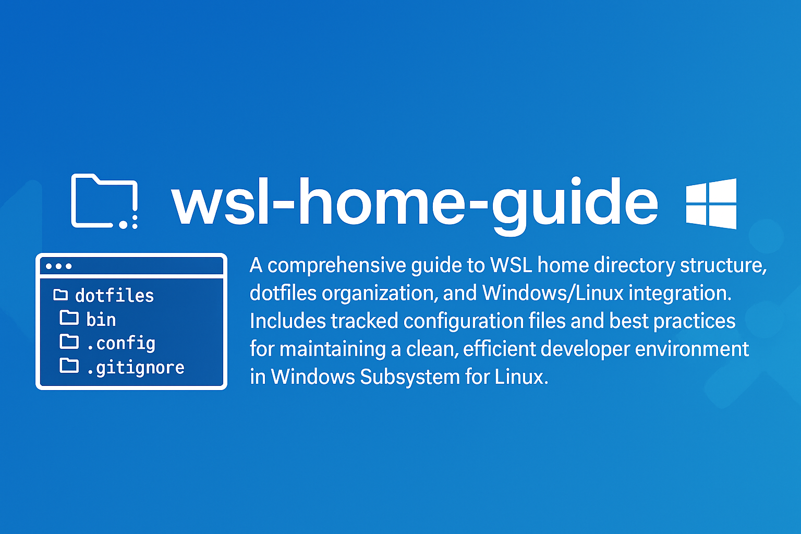

## 🧰 How to Use This Template    
Click the green **"Use this template"** button at the top of the page, then choose **"Create a new repository"**.   
This will create your own copy of this project, which you can modify freely — no need to fork!   

---

<p align="center">
  
</p>

<h1 align="center">WSL Home Directory Structure & Windows Integration Guide</h1>

This document provides an overview of the organization and purpose of files and directories in my home directory (`/home/mostafa`) and how they integrate with the Windows file system.

---

## Table of Contents

<details>
  <summary><a href="#1-about-this-repository"><i><b>1. About this Repository</b></i></a></summary>
  <div>
    &nbsp;&nbsp;&nbsp;&nbsp;&nbsp;&nbsp;&nbsp;&nbsp;&nbsp;&nbsp;<a href="#11-who-is-this-tutorial-for">1.1. Who Is This Tutorial For?</a><br>
    &nbsp;&nbsp;&nbsp;&nbsp;&nbsp;&nbsp;&nbsp;&nbsp;&nbsp;&nbsp;<a href="#12-what-will-you-learn">1.2. What Will You Learn?</a><br>
    &nbsp;&nbsp;&nbsp;&nbsp;&nbsp;&nbsp;&nbsp;&nbsp;&nbsp;&nbsp;<a href="#13-prerequisites">1.3. Prerequisites</a><br>
    &nbsp;&nbsp;&nbsp;&nbsp;&nbsp;&nbsp;&nbsp;&nbsp;&nbsp;&nbsp;<a href="#14-contents-of-this-readmemd">1.4. Contents of this README.md</a><br>
  </div>
</details>
&nbsp;

<details>
  <summary><a href="#2-directory-categories"><i><b>2. Directory Categories</b></i></a></summary>
  <div>
    &nbsp;&nbsp;&nbsp;&nbsp;&nbsp;&nbsp;&nbsp;&nbsp;&nbsp;&nbsp;<a href="#21-project-directories">2.1. Project Directories</a><br>
    &nbsp;&nbsp;&nbsp;&nbsp;&nbsp;&nbsp;&nbsp;&nbsp;&nbsp;&nbsp;<a href="#22-configuration-files--directories">2.2. Configuration Files & Directories</a><br>
    &nbsp;&nbsp;&nbsp;&nbsp;&nbsp;&nbsp;&nbsp;&nbsp;&nbsp;&nbsp;<a href="#23-system--user-directories">2.3. System & User Directories</a><br>
  </div>
</details>
&nbsp;

<details>
  <summary><a href="#3-best-practices"><i><b>3. Best Practices</b></i></a></summary>
  <div>
    &nbsp;&nbsp;&nbsp;&nbsp;&nbsp;&nbsp;&nbsp;&nbsp;&nbsp;&nbsp;<a href="#31-organization-tips">3.1. Organization Tips</a><br>
    &nbsp;&nbsp;&nbsp;&nbsp;&nbsp;&nbsp;&nbsp;&nbsp;&nbsp;&nbsp;<a href="#32-wsl-specific-notes">3.2. WSL-Specific Notes</a><br>
    &nbsp;&nbsp;&nbsp;&nbsp;&nbsp;&nbsp;&nbsp;&nbsp;&nbsp;&nbsp;<a href="#33-maintenance-suggestions">3.3. Maintenance Suggestions</a><br>
    &nbsp;&nbsp;&nbsp;&nbsp;&nbsp;&nbsp;&nbsp;&nbsp;&nbsp;&nbsp;<a href="#34-shell-environment-setup">3.4. Shell Environment Setup</a><br>
  </div>
</details>
&nbsp;

<details>
  <summary><a href="#4-git-dotfiles-backup-system"><i><b>4. Git Dotfiles Backup System</b></i></a></summary>
  <div>
    &nbsp;&nbsp;&nbsp;&nbsp;&nbsp;&nbsp;&nbsp;&nbsp;&nbsp;&nbsp;<a href="#41-how-this-repository-is-set-up">4.1. How This Repository is Set Up</a><br>
    &nbsp;&nbsp;&nbsp;&nbsp;&nbsp;&nbsp;&nbsp;&nbsp;&nbsp;&nbsp;<a href="#411-tracked-files">4.1.1. Tracked Files</a><br>
    &nbsp;&nbsp;&nbsp;&nbsp;&nbsp;&nbsp;&nbsp;&nbsp;&nbsp;&nbsp;<a href="#412-backup-strategy">4.1.2. Backup Strategy</a><br>
    &nbsp;&nbsp;&nbsp;&nbsp;&nbsp;&nbsp;&nbsp;&nbsp;&nbsp;&nbsp;<a href="#413-using-this-system">4.1.3. Using This System</a><br>
    &nbsp;&nbsp;&nbsp;&nbsp;&nbsp;&nbsp;&nbsp;&nbsp;&nbsp;&nbsp;<a href="#42-advantages-and-considerations">4.2. Advantages and Considerations</a><br>
    &nbsp;&nbsp;&nbsp;&nbsp;&nbsp;&nbsp;&nbsp;&nbsp;&nbsp;&nbsp;<a href="#421-advantages">4.2.1. Advantages</a><br>
    &nbsp;&nbsp;&nbsp;&nbsp;&nbsp;&nbsp;&nbsp;&nbsp;&nbsp;&nbsp;<a href="#422-potential-issues">4.2.2. Potential Issues</a><br>
    &nbsp;&nbsp;&nbsp;&nbsp;&nbsp;&nbsp;&nbsp;&nbsp;&nbsp;&nbsp;<a href="#423-alternative-approaches">4.2.3. Alternative Approaches</a><br>
  </div>
</details>
&nbsp;

<details>
  <summary><a href="#5-windows-and-linux-file-system-integration"><i><b>5. Windows and Linux File System Integration</b></i></a></summary>
  <div>
    &nbsp;&nbsp;&nbsp;&nbsp;&nbsp;&nbsp;&nbsp;&nbsp;&nbsp;&nbsp;<a href="#51-understanding-wsl-file-system-structure">5.1. Understanding WSL File System Structure</a><br>
    &nbsp;&nbsp;&nbsp;&nbsp;&nbsp;&nbsp;&nbsp;&nbsp;&nbsp;&nbsp;<a href="#52-file-path-conventions">5.2. File Path Conventions</a><br>
    &nbsp;&nbsp;&nbsp;&nbsp;&nbsp;&nbsp;&nbsp;&nbsp;&nbsp;&nbsp;<a href="#53-performance-considerations">5.3. Performance Considerations</a><br>
    &nbsp;&nbsp;&nbsp;&nbsp;&nbsp;&nbsp;&nbsp;&nbsp;&nbsp;&nbsp;<a href="#54-symlinks-and-integration">5.4. Symlinks and Integration</a><br>
    &nbsp;&nbsp;&nbsp;&nbsp;&nbsp;&nbsp;&nbsp;&nbsp;&nbsp;&nbsp;<a href="#55-permission-differences">5.5. Permission Differences</a><br>
    &nbsp;&nbsp;&nbsp;&nbsp;&nbsp;&nbsp;&nbsp;&nbsp;&nbsp;&nbsp;<a href="#56-best-practices-for-cross-platform-development">5.6. Best Practices for Cross-Platform Development</a><br>
  </div>
</details>
&nbsp;

---

# 1. About this Repository

Information about this repository to give a birds-eye view to the reader. This guide maps out the structure of a typical WSL (Windows Subsystem for Linux) home directory, documenting both visible directories and hidden configuration files that are essential to system functionality.

This repository also serves as a Git-based backup system for important configuration files (dotfiles) in the home directory. The repository is set up to track only specific configuration files while ignoring everything else.

## 1.1. Who Is This Tutorial For?

This guide is designed for several audiences:
- **Linux/WSL newcomers** who want to understand their home directory structure
- **Developers** who need to navigate efficiently between project files and configurations
- **System administrators** who want to maintain organized file systems
- **Anyone using WSL** who wants to understand the relationship between Windows and Linux environments

## 1.2. What Will You Learn?

By reading this guide, you will:
- Understand the purpose and function of each directory in your home folder
- Learn how configuration files control your development environment
- Discover best practices for organizing projects and files
- Gain insights into WSL-specific configurations and symlinks
- Learn effective maintenance strategies for your home directory

## 1.3. Prerequisites

1. **For those familiar with Linux systems**: This guide will serve as a reference for WSL-specific configurations and organization strategies.
2. **For those familiar with Windows but new to Linux/WSL**: You'll find explanations of Linux directory structures and how they relate to the Windows file system.
3. **For beginners with no prior knowledge of Windows, Linux, or WSL**: This guide starts from the basics and explains each component of your home directory in detail, including both Windows and Linux concepts.

## 1.4. Contents of this `README.md`

```
Folder PATH listing
+---.cache                  <-- Non-essential cached data
│
+---.config                 <-- Application configuration files
│
+---.cursor                 <-- Cursor editor settings
│
+---.cursor-server          <-- Cursor editor server components
│
+---.dbclient               <-- Database client configurations
│
+---.dbus                   <-- D-Bus message system configuration
│
+---.docker                 <-- Docker configuration and credentials
│
+---.dotnet                 <-- .NET SDK and runtime
│
+---.gk                     <-- GitKraken configuration
│
+---.ipython                <-- IPython configuration
│
+---.jupyter                <-- Jupyter notebook configuration
│
+---.keras                  <-- Keras machine learning framework settings
│
+---.landscape              <-- Landscape system management tool configuration
│
+---.local                  <-- User-specific applications and data
│
+---.minikube               <-- Kubernetes development environment
│
+---.npm                    <-- Node Package Manager cache and configuration
│
+---.nv                     <-- NVIDIA configurations
│
+---.nvm                    <-- Node Version Manager
│
+---.oh-my-zsh              <-- Oh My Zsh framework
│
+---.pki                    <-- Public Key Infrastructure certificates
│
+---.rest-client            <-- REST client tool configurations
│
+---.ssh                    <-- SSH keys and configuration
│
+---.texlive2021            <-- TeX Live distribution configuration
│
+---.vscode                 <-- VS Code settings and extensions
│
+---.vscode-R               <-- VS Code R language extension settings
│
+---.vscode-cli             <-- VS Code command-line interface
│
+---.vscode-remote-containers <-- VS Code container development configuration
│
+---.vscode-server          <-- VS Code server for remote development
│
+---.wdm                    <-- WebDriver manager for browser automation
│
+---.yarn                   <-- Yarn package manager files
│
+---SaveBirds.app           <-- SaveBirds application directory
│
+---SaveBirds_Archive       <-- Archive of SaveBirds application
│
+---projects                <-- Main workspace for development projects
│
+---workshops               <-- Workshop materials and tutorials
│       github_repo_duplicator <-- Tool for duplicating GitHub repositories
│
│       .aws -> /mnt/c/Users/Mostafa/.aws <-- Symlink to Windows AWS configuration
│       .azure -> /mnt/c/Users/Mostafa/.azure <-- Symlink to Windows Azure configuration
│       .bash_history       <-- Bash command history
│       .bash_logout        <-- Commands executed when logging out of bash
│       .bashrc             <-- Bash shell configuration
│       .git-credentials    <-- Stored Git credentials
│       .gitconfig          <-- Global Git configuration
│       .gitignore_global   <-- Global Git ignore patterns
│       .inputrc            <-- Input configuration for command line
│       .lesshst            <-- Less pager history
│       .motd_shown         <-- Message of the day flag file
│       .profile            <-- Login shell configuration
│       .python_history     <-- Python interpreter history
│       .shell.pre-oh-my-zsh <-- Shell configuration before Oh My Zsh
│       .sudo_as_admin_successful <-- Sudo privilege indicator
│       .viminfo            <-- Vim editor information
│       .wget-hsts          <-- wget HSTS database
│       .xprofile           <-- X session configuration
│       .yarnrc             <-- Yarn package manager configuration
│       .zcompdump          <-- Zsh completion cache
│       .zcompdump-Mostafa-Laptop-3-5.8.1 <-- Zsh completion dump
│       .zcompdump-Mostafa-Laptop-3-5.8.1.Mostafa-Laptop-3.3390 <-- Zsh completion dump for specific session
│       .zcompdump-Mostafa-Laptop-3-5.8.1.zwc <-- Compiled Zsh completion dump
│       .zsh_history        <-- Z shell command history
│       .zshrc              <-- Z shell configuration
│       .zshrc.save         <-- Saved Z shell configuration
│       .zshrc.swp          <-- Z shell configuration swap file
│       README.md           <-- WSL Home Directory Structure Guide
```

# 2. Directory Categories

## 2.1. Project Directories

### 2.1.1. ~/projects/
Main workspace for development projects and code repositories. This directory contains various coding projects, experiments, and applications under development.

### 2.1.2. ~/workshops/
Contains workshop materials, tutorials, and learning resources. This is where educational content and training materials are stored.

### 2.1.3. ~/SaveBirds.app/ and ~/SaveBirds_Archive/
Specific project directories related to the SaveBirds application. The .app directory contains the current version while the Archive contains previous versions or backups.

## 2.2. Configuration Files & Directories

### 2.2.1. Shell Configuration
- `.bashrc`: Bash shell configuration for interactive shell settings
- `.bash_logout`: Commands executed when logging out of bash
- `.zshrc`: Z shell configuration with customizations and plugin settings
- `.zsh_history`: Z shell command history for reference and reuse
- `.profile`: Login shell configuration for environment variables
- `.oh-my-zsh/`: Oh My Zsh framework for zsh with themes and plugins

### 2.2.2. Git Configuration
- `.gitconfig`: Global Git configuration including user information and aliases
- `.gitignore_global`: Global Git ignore patterns to exclude common temporary files
- `.git-credentials`: Stored Git credentials for repository access

### 2.2.3. Development Environment
- `.vscode/`: VS Code settings and extensions configuration
- `.vscode-server/`: VS Code server for remote development in WSL
- `.vscode-remote-containers/`: VS Code container development configuration
- `.cursor/`: Cursor editor settings
- `.cursor-server/`: Cursor editor server components
- `.rest-client/`: REST client tool configurations for API testing

### 2.2.4. Programming Languages & Frameworks
- `.nvm/`: Node Version Manager for JavaScript development
- `.npm/`: Node Package Manager cache and configuration
- `.yarn/`: Yarn package manager configuration for JavaScript projects
- `.dotnet/`: .NET SDK and runtime for C# development
- `.python_history`: Python interpreter command history

### 2.2.5. Data Science & Machine Learning
- `.jupyter/`: Jupyter notebook configuration for data science work
- `.ipython/`: IPython configuration for interactive Python development
- `.keras/`: Keras machine learning framework settings
- `.wdm/`: WebDriver manager for browser automation testing

### 2.2.6. Container & Cloud Tools
- `.docker/`: Docker configuration and credentials for containerization
- `.minikube/`: Kubernetes development environment configuration
- `.aws/` -> `/mnt/c/Users/Mostafa/.aws`: Symlink to AWS configuration on Windows
- `.azure/` -> `/mnt/c/Users/Mostafa/.azure`: Symlink to Azure configuration on Windows

## 2.3. System & User Directories

### 2.3.1. Local System Configuration
- `.local/`: User-specific applications and data
- `.config/`: Application configuration files for various programs
- `.cache/`: Non-essential cached data to improve performance
- `.pki/`: Public Key Infrastructure certificates for secure connections
- `.ssh/`: SSH keys and configuration for secure remote access

### 2.3.2. Other System Files
- `.dbus/`: D-Bus message system configuration for inter-process communication
- `.landscape/`: Landscape system management tool configuration
- `.motd_shown`: Message of the day flag file (login message control)
- `.sudo_as_admin_successful`: Sudo privilege indicator for administrative access

# 3. Best Practices

## 3.1. Organization Tips

- Maintain clear separation between projects in `~/projects/` using consistent naming conventions
- Back up configuration files regularly to preserve your environment settings:
  - Create a dedicated `dotfiles` repository to version control important configs
  - Use symbolic links from the repository to your home directory
  - Include essential configs like `.bashrc`, `.zshrc`, `.gitconfig`, and editor settings
  - Document installation steps in the repository's README
  - Consider using tools like `yadm`, `chezmoi`, or `dotbot` for dotfile management
  - Schedule automatic backups of configs not in version control
  - Test your backup by restoring in a fresh WSL instance periodically
- Use version control for important personal configuration files
- Create separate directories for different types of projects (web, data science, etc.)

## 3.2. WSL-Specific Notes

- Symlinks to Windows files (`.aws`, `.azure`) provide cross-platform access to configuration
- Windows files can be accessed through `/mnt/c/`
- Consider using filesystem performance best practices for cross-OS operations
- Keep projects that need Windows integration in locations accessible to both systems
- Use WSL-specific backup strategies that account for both Linux and Windows files

## 3.3. Maintenance Suggestions

- Regularly clean `~/.cache/` to free up space and improve performance:
  - Use `du -sh ~/.cache/` to check current cache size
  - Run `rm -rf ~/.cache/*` to clear all caches (some applications may need to rebuild caches)
  - Consider adding periodic cleanup to your crontab: `0 0 * * 0 rm -rf ~/.cache/*`
  - For selective clearing, target specific directories like `~/.cache/npm/` or `~/.cache/pip/`

- Archive completed projects from `~/projects/` to reduce clutter:
  - Create a compressed archive with `tar -czvf project-name-$(date +%Y%m%d).tar.gz ~/projects/project-name/`
  - Move archives to a dedicated storage location or cloud backup
  - Consider git-bundling active repositories: `git bundle create ~/archives/repo-name.bundle --all`
  - Document project status and important details before archiving

- Update shell configurations periodically to incorporate useful new features:
  - For Oh-My-Zsh: `cd ~/.oh-my-zsh && git pull && upgrade_oh_my_zsh`
  - Check for plugin updates in package managers (npm, pip, etc.)
  - Review release notes for your shell and tools to identify new features
  - Test new configurations in a temporary shell before committing changes

- Review and remove unused software configurations to minimize complexity:
  - Identify large configuration directories with `du -sh ~/.config/* | sort -hr`
  - Remove configurations for uninstalled software with `apt list --installed | grep -v "config"`
  - Check for outdated package managers' caches: `yarn cache clean`, `npm cache clean --force`
  - Use `ncdu` for interactive exploration of directory sizes: `ncdu ~/.config/`

- Monitor disk usage regularly to identify growth trends:
  - Run `df -h` to check filesystem usage
  - Monitor WSL2 virtual disk size (typically at `%USERPROFILE%\AppData\Local\Packages\*Ubuntu*\LocalState\ext4.vhdx`)
  - Use `wsl --shutdown` occasionally from Windows to compact the virtual disk
  - Consider setting up disk quotas for critical directories

- Perform WSL-specific maintenance:
  - Update Ubuntu packages: `sudo apt update && sudo apt upgrade`
  - Check for WSL updates from Windows Store or with `wsl --update`
  - Restart the WSL instance occasionally: `wsl --shutdown` from Windows cmd
  - Review Windows interoperability settings in `/etc/wsl.conf`

- Document system configuration for disaster recovery:
  - Maintain a list of essential packages: `apt list --installed > ~/installed-packages.txt`
  - Export environment variables: `env > ~/environment-snapshot.txt`
  - Record custom configurations and their purposes
  - Create a setup script that can restore your environment on a new system

## 3.4. Shell Environment Setup

### 3.4.1. Zsh and Oh-My-Zsh Installation

In this environment, Zsh and Oh-My-Zsh are installed immediately after setting up Linux for an enhanced shell experience:

```bash
# Install Zsh
sudo apt update
sudo apt install -y zsh

# Install Oh-My-Zsh
sh -c "$(curl -fsSL https://raw.githubusercontent.com/ohmyzsh/ohmyzsh/master/tools/install.sh)"

# Set Zsh as default shell
chsh -s $(which zsh)

# To activate changes without logging out and back in
exec zsh
# Or alternatively, restart your terminal application
```

The `.oh-my-zsh` directory contains the framework files, while `.zshrc` contains customized configurations, including plugins, themes, and aliases.

After making changes to `.zshrc`, remember to either source the file or restart the terminal:
```bash
# Apply changes to .zshrc in the current session
source ~/.zshrc
```

### 3.4.2. Bash Configuration Best Practices

Although Zsh is the primary shell, following best practices for `.bashrc` is important:

1. **Maintain a minimal but functional `.bashrc`**: Even when not using Bash regularly, keeping a clean, minimal configuration ensures that if Bash is ever invoked, it will work correctly.

2. **Options for handling `.bashrc` when using Zsh**:
   - **Keep the default**: Retain the original `.bashrc` file unchanged
   - **Create a minimal version**: Remove unnecessary configurations while keeping essential functionality
   - **Add auto-switching**: Configure `.bashrc` to automatically switch to Zsh when Bash is started
   - **Symlink to `.zshrc`**: (Not recommended due to syntax differences)

3. **Our approach**: A minimal `.bashrc` that:
   - Clearly documents that Zsh is the preferred shell
   - Maintains basic terminal functionality
   - Preserves essential environment variables (PATH, DISPLAY, etc.)
   - Uses consistent section headers for readability
   - Optionally includes code to automatically switch to Zsh

This approach ensures that the system remains functional regardless of which shell is invoked, while making it clear that Zsh is the preferred environment.

# 4. Git Dotfiles Backup System

## 4.1. How This Repository is Set Up

This home directory is configured as a Git repository specifically for backing up important configuration files (dotfiles). The repository uses a special .gitignore configuration that ignores everything by default and only tracks specific files that are explicitly included.

### 4.1.1. Tracked Files

The following important configuration files are tracked by Git:
- `README.md`: This documentation file
- `.bashrc`: Bash shell configuration
- `.zshrc`: Z shell configuration
- `.profile`: Login shell configuration
- `.bash_logout`: Commands executed when logging out of bash
- `.gitconfig`: Global Git configuration
- `.gitignore_global`: Global Git ignore patterns
- `.inputrc`: Input configuration for command line
- `.shell.pre-oh-my-zsh`: Shell configuration before Oh My Zsh
- `.viminfo`: Vim editor information
- `.gitignore`: The special ignore file that controls this repository

### 4.1.2. Backup Strategy

This repository allows you to:
1. Track changes to important configuration files
2. Roll back to previous versions if needed
3. Easily sync your configuration across multiple machines
4. Document your setup for future reference

### 4.1.3. Using This System

To back up your configuration:
```bash
# After making changes to any tracked file
git add -u
git commit -m "Update: [description of changes]"

# To back up to a remote repository (recommended)
git remote add origin [your-repo-url]
git push -u origin main
```

To restore your configuration on a new machine:
```bash
# Clone your repository to your home directory
git clone [your-repo-url] ~/dotfiles-temp
cd ~/dotfiles-temp
# Copy files to your home directory or use symlinks
cp -r .* ~ 2>/dev/null || true
```

## 4.2. Advantages and Considerations

This setup uses what's known as the "dotfiles repository" approach, a method many developers employ to track and synchronize their configuration files across different environments.

### 4.2.1. Advantages

- **Selective tracking**: Clean way to track only essential configuration files
- **Portability**: Easy to restore settings on a new machine
- **Version control**: Full history and rollback capabilities for your important configurations
- **Documentation**: Repository can include documentation about your setup (like this README)
- **Centralized management**: Single source of truth for all your configuration

### 4.2.2. Potential Issues

1. **Merge conflicts**: If you use different configurations on different machines, you might face merge conflicts when attempting to synchronize.

2. **Accidental tracking**: With the "ignore everything except specific files" approach, you need to be careful when using `git add .` as it won't add new files unless explicitly allowed in the .gitignore.

3. **Home directory as a git repo**: Some tools might behave unexpectedly when your entire home directory is a git repository. This is rare but possible.

4. **Symlinks**: If you add symlinked files (like `~/.aws` → `/mnt/c/Users/Mostafa/.aws`), git will store the symlink, not the actual content.

### 4.2.3. Alternative Approaches

A safer alternative many developers prefer is creating a separate `~/dotfiles` repository with symlinks to your actual config files or using specialized dotfile management tools:

- **GNU Stow**: Tool that creates symlinks from your dotfiles repo to your home directory
- **chezmoi**: Advanced dotfile manager with templating and encryption features
- **yadm**: Yet Another Dotfiles Manager with built-in encryption and alternative files for different systems

The current setup works well for demonstration purposes and for single-machine use. For multi-machine setups with varying configurations, consider one of the alternative approaches.

# 5. Windows and Linux File System Integration

## 5.1. Understanding WSL File System Structure

- **Linux root (`/`) vs. Windows drives**: In WSL, the Linux file system exists separately from Windows. The Linux root directory (`/`) is different from Windows drive letters.
- **Accessing Windows files**: Windows drives are mounted under `/mnt/` in WSL:
  - Windows `C:\` is accessible at `/mnt/c/` in WSL
  - Windows `D:\` is accessible at `/mnt/d/` in WSL (if you have a D: drive)
- **WSL filesystem location**: Your Linux files in WSL are stored in a virtual disk on Windows, usually at `%USERPROFILE%\AppData\Local\Packages\<DistroName>\LocalState\`

## 5.2. File Path Conventions

| Windows | WSL (Linux) | Notes |
|---------|-------------|-------|
| `C:\Users\Mostafa\Documents` | `/mnt/c/Users/Mostafa/Documents` | Windows user directories |
| `C:\Program Files` | `/mnt/c/Program Files` | Space in path requires quotes in Linux commands |
| Backslash: `\` | Forward slash: `/` | Path separators differ |
| `D:\Projects` | `/mnt/d/Projects` | Secondary drive access |
| `%USERPROFILE%` | `$HOME` or `~` | Home directory environment variables |

## 5.3. Performance Considerations

- **Native filesystem performance**: 
  - Linux operations are faster in the WSL filesystem (`/home/mostafa/`)
  - Windows operations are faster in the Windows filesystem (`/mnt/c/`)
- **Cross-filesystem operations**: Working across filesystems (like running Linux commands on Windows files) can be significantly slower
- **Recommended practices**:
  - Keep code and development files in the Linux filesystem for best Linux tool performance
  - Keep large binaries, media files, or Windows-specific files in the Windows filesystem
  - Use symlinks when necessary to create references across systems

## 5.4. Symlinks and Integration

- **WSL to Windows symlinks**: Created using `ln -s /mnt/c/path/to/windows/file ~/path/in/linux`
- **Common symlinks**:
  - `.aws -> /mnt/c/Users/Mostafa/.aws`: Sharing cloud credentials
  - `.azure -> /mnt/c/Users/Mostafa/.azure`: Sharing Azure settings
- **Windows to WSL access**: Access WSL files from Windows at `\\wsl$\Ubuntu\home\mostafa\`
- **Environment sharing**: Consider sharing environment variables needed in both systems

## 5.5. Permission Differences

- **Windows permissions**: Based on Access Control Lists (ACLs)
- **Linux permissions**: Based on user/group/others with read/write/execute bits
- **WSL handling**: WSL attempts to map permissions between systems
- **Common issues**:
  - Executable scripts from Windows may need `chmod +x` in WSL
  - Files created in `/mnt/c/` from WSL may have unexpected permissions in Windows
  - Files with sensitive permissions should be kept in the native filesystem

## 5.6. Best Practices for Cross-Platform Development

- Keep build artifacts in the same filesystem as your build tools
- Use WSL for Linux-focused development even when working with files in `/mnt/c/`
- Use Visual Studio Code Remote WSL extension for seamless editing
- Consider creating a dedicated development directory accessible to both systems
- For databases or file-intensive operations, keep data in the appropriate native filesystem